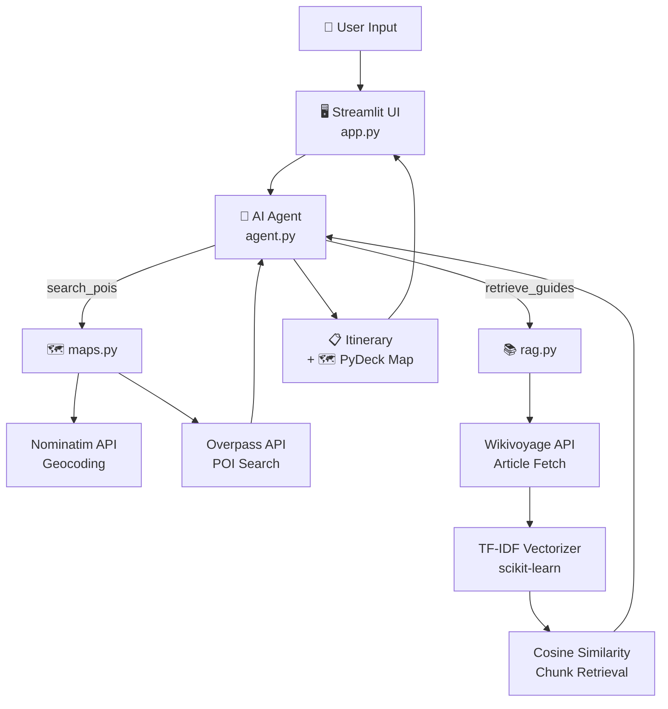

# ✈️ Trip Planner AI Agent

An AI-powered trip planning application built with **Streamlit**, **OpenAI**, and real-time data from **OpenStreetMap** and **Wikivoyage**. The agent autonomously searches for Points of Interest, retrieves travel guides, and generates personalized day-by-day itineraries — all visualized on an interactive map.

## 🌐 Live Demo

> **[Launch App Here](https://agentic-ai-trip-planner.streamlit.app/)**  
> *(Bring your own OpenAI API key — no data is stored)*

## Features

- 🤖 **Agentic AI Workflow** — OpenAI function calling orchestrates multi-step tool use autonomously
- 📍 **Real POI Data** — Live Points of Interest from OpenStreetMap via Overpass API
- 📚 **RAG Travel Guides** — Wikivoyage articles chunked, vectorized with TF-IDF, and retrieved semantically
- 🗺️ **Interactive Map** — PyDeck visualization with day-by-day color coding and route paths
- ✏️ **Natural Language Refinement** — Refine your itinerary in plain English, multiple rounds supported
- 💾 **Version History** — All previous itinerary versions are preserved in-session
- ⬇️ **JSON Export** — Download your full itinerary with all POI data
- 🔒 **Secure API Key Handling** — Keys stored in session state only, never persisted

## Architecture

                    
**Data flow:**
1. User submits trip details
2. Agent calls `search_pois` → Nominatim geocodes city → Overpass returns real POIs
3. Agent calls `retrieve_guides` → Wikivoyage article → chunked → TF-IDF search → top-k chunks returned
4. Agent generates itinerary using only verified POIs + guide context
5. UI renders itinerary + PyDeck map + download button

## Tech Stack

| Layer | Technology |
|---|---|
| UI | Streamlit |
| AI Agent | OpenAI Responses API (`gpt-4.1-mini`) |
| POI Data | OpenStreetMap Nominatim + Overpass API |
| Travel Guides | Wikivoyage MediaWiki API |
| RAG | scikit-learn TF-IDF + cosine similarity |
| Map | PyDeck (deck.gl) + CartoCDN tiles |
| Language | Python 3.9+ |

## Project Structure

```
trip-planner/
│
├── app.py           # Streamlit UI — pages, forms, map, refinement
├── agent.py         # AI agent loop + refine_itinerary function
├── maps.py          # Geocoding (Nominatim) + POI search (Overpass)
├── rag.py           # Wikivoyage fetch + TF-IDF chunking + search
├── config.py        # Constants: INTEREST_TO_TAGS, TOOLS schemas
│
├── data/            # Auto-created — saved itineraries (JSON)
├── requirements.txt
```

## Example Use Cases

**City Break:**
> *"Plan a 3-day trip to Rome for a couple who love history and food. Relaxed pace."*

**Family Trip:**
> *"Plan a 2-day trip to Amsterdam for a family with kids. Constraints: child-friendly activities only."*

**Refinement:**
> *"Make Day 2 more outdoorsy and add more restaurant options for dinner."*

## requirements.txt

```
streamlit
openai
pydeck
requests
scikit-learn
numpy
pandas
```

---

## ⚠️ Notes

- OpenStreetMap data quality varies by city — major cities return the best POI results
- Wikivoyage articles may not exist for all destinations — the app handles this gracefully
- Session state is isolated per user — multiple simultaneous users are fully supported
- API keys are **never** logged or stored beyond the active session

---
